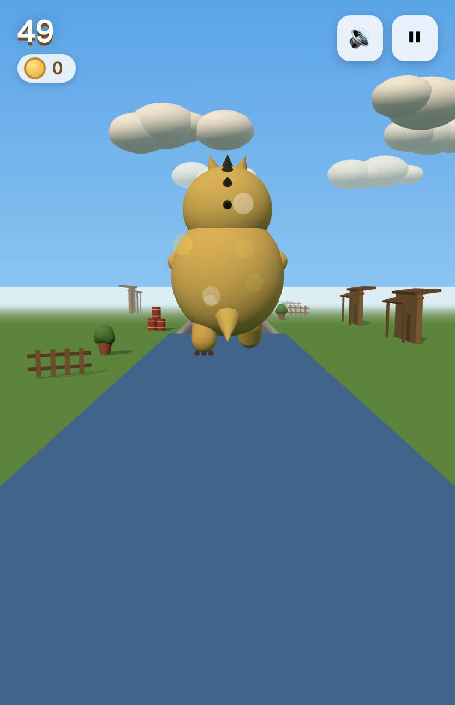

# 🐉 奶龙冲浪 · Nailong Surf 3D

A Subway-Surfers-style endless runner starring **奶龙 (Nailong)**, the yellow dragon meme from China — rebuilt in real 3D with Three.js, set in a cozy courtyard theme (potted plants, red barrels, wooden fences and houses).



## 🎮 Run it locally

**Easiest way (no tools needed):**

> Double-click `dist/index.html` — the whole game is bundled into that single file (engine included), it runs offline in any modern browser.

**Or serve the source version:**

```bash
# any static server works, e.g.:
python3 -m http.server 8000
# or with gzip (faster over networks):
ruby gz_server.rb
```

Then open http://localhost:8000 (or http://localhost:8765 for the ruby server).

## 🕹️ Controls

| Key / Gesture | Action |
| --- | --- |
| ← → (or A / D) | switch lanes |
| ↑ / Space (or W) | jump — land on train roofs! |
| ↓ (or S) | roll under "低头!" signs / slam down |
| P / Esc | pause |
| M | mute |
| swipe (touch) | full mobile support |

## ✨ Features

- 3-lane endless runner, speed ramps up with distance
- **Jump-on-able obstacles**: trains, overhead signs and hurdle bars are platforms — with coin trails on the roofs
- **Shield power-up** 🛡️: a rotating iron shield inside a faded blue sphere; pick it up for a protective bubble that absorbs one crash (rescue hop + brief invulnerability)
- Coin collecting (+50 each), score high-score saved to localStorage
- Original chiptune-y background music and sound effects (Web Audio, no assets)
- Everything is procedural — no textures or models to load beyond Three.js itself

## 🗂️ Repo layout

```
index.html          # game source (imports ./lib/three.module.js)
lib/three.module.js # Three.js r160 (bundled locally)
dist/index.html     # self-contained single-file build (open this!)
build.rb            # rebuilds dist/index.html from source
gz_server.rb        # optional gzip static server
docs/               # screenshots
```

## 🔧 Hacking on it

The entire game lives in one `<script type="module">` inside `index.html`. After editing, rebuild the single-file version:

```bash
ruby build.rb
```

Have fun! 🥛
